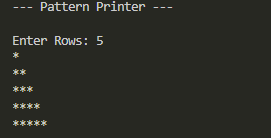

# AIM: Write a Python program to print a triangle pattern (give any), emphasizing the transition from C to Python syntax.


## Input
```
Enter Rows: 5
```

## Output
```
*
**
***
****
*****
```

## Sample Output
